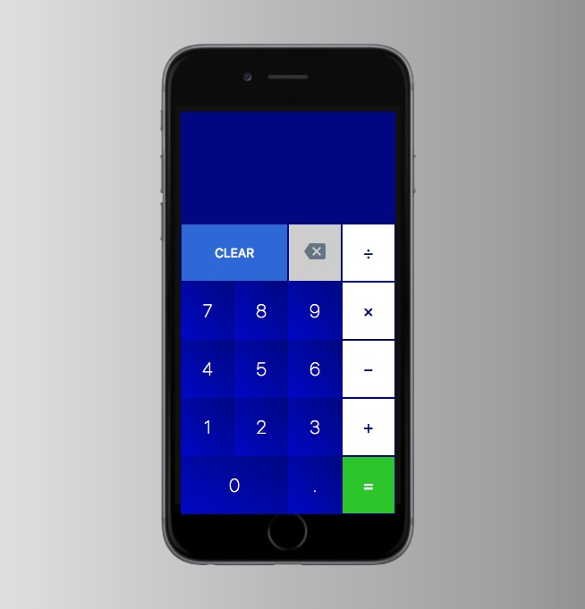

# Calculator

## Odin Project Calculator

1. JavaScript, HTML, CSS

2. Create calculator that incorporates basic math operators

3. Capable of returning results for series of inputs

4. Includes backspace and clear methods
